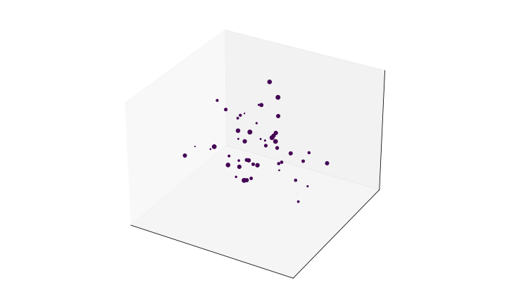
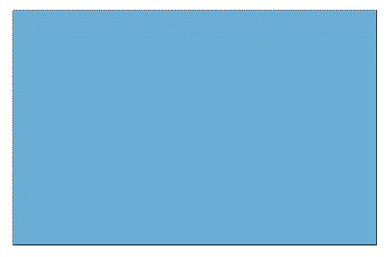
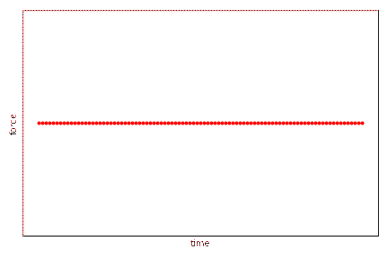
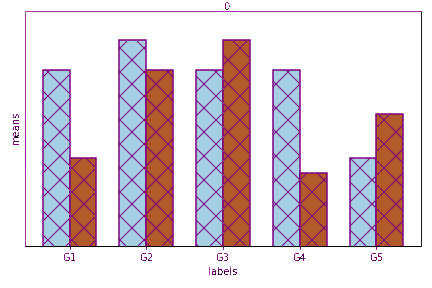
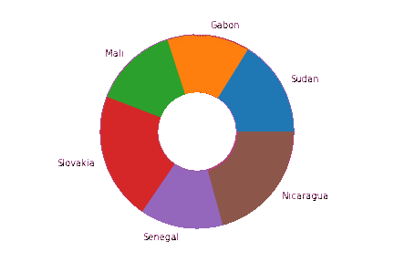

# giffy: Turning Data Arrays into Matplotlib GIFs.
=============================================

<table>
<tr>
<td></td>
<td></td>
<td></td>
<td></td>
<td></td>
</tr>
</table>


## What is it?

`giffy` is a *declarative* plotting library for turning time-based data into GIF animations. Writing custom code for explainable animations is time-consuming and requires deep knowledge of various aspects of Matplotlib. We handle this for you by providing a common interface for all formats.

## Main Features

* Turn your time-series data into a GIF **in one line of code**.
* Sick of ugly jumpy animations? Use our automatic linear interpolation (**lerp**) for smoother and crisper animations.
* A number of plotting formats out-of-the box, with appropriate customizations to meet your needs.
* Animations are defined in a declarative fashion, so no computational overhead until you want to generate the animation.

## How to use

Given some Gaussian distributed data in appropriate form, we can create a simple brownian motion animation in one line within JupyterLab:

```python
import giffy as gif
import numpy as np

# 10 time steps, 50 samples.
X = np.random.randn(10, 50)
# create a Gif.Scatter object, change the marker type, linearly interpolate and finally plot.
gif.Scatter(X=X, Y=X, Z=X).mark(marker='.').lerp().plot()
```

This gives an animation similar to the one displayed within this README. Note that no plotting occurs until the `.plot()` function is called at the end, leading to a fully declarative approach to visualization similar to packages like `altair`. Save your gifs to a file instead of plotting using the `.save()` command.

Please check out the selection within the [`examples/`](examples/) folder for specifics for each plot type.

## Where to get it

The source code is currently on GitHub at https://github.com/gregparkes/giffy. There are plans to make a PyPI version at a later date.

## Dependencies

Giffy supports Python 3.7+  and does not support Python 2.x.

For drawing the animations you will probably need FFMPEG installed including the appropriate Python package, or some alternative backend compatible with Matplotlib. Furthermore you will need:

* [Matplotlib](https://matplotlib.org/stable/index.html): This package is built on top of Matplotlib technology.
* [NumPy](https://numpy.org/): Support for vector and matrix calculations.
* [SciPy](https://scipy.org/): Support for Linear Interpolations.
* [Pandas](https://pandas.pydata.org/): Support for Tabular Datasets and automatic plot labelling.

These can all be obtained using PyPI (within an appropriate environment).

```bash
pip install -r requirements.txt
```

Ideally this works best within [JupyterLab/Notebook](https://jupyter.org/) for the immediate visual results, hence installing jupyter is strongly recommanded.

## Philosophy

The main thinking behind this package is to break up your desired animation into a number of key working steps:

1. *Augment* your data into an appropriate shape and format. In this library we assume the 'time' axis is the rows of the Dataframe, or the first dimension in a numpy array.
2. *Set up* the plotting area using the data. We do this for you so you don't have to think about things like setting the axis limits and so forth.
3. Specify the *first plot*: This is the first line at t=0 of the animation, or the first colormesh out of many for a `plt.pcolormesh` plot. 
4. Create a function which *updates* the plot at each time step. Rather than clearing the canvas we want to intelligently update the data in the colormesh, line, pie chart etc for each time step for you. 
5. Using the first plot and updating function, define your animation and show/save it. This occurs when you make a call to `.plot()` or `.save()` respectively. 

Whilst the majority of these steps are abstracted away from the user, it is important to think on these when defining your animation. 

## FAQ

1. *Why don't you support histograms or boxplots?*
    - A histogram is merely a bar plot that has undergone aggregation on the data. At this stage of the project we have aimed to keep it as minimalistic as possible.
2. *I want more Matplotlib customization in my GIFs.*
    - Use `matplotlib.rcParams` and modify the customization you want. It is possible that the modification you seek is used in the `.mark()` function within most giffy objects.
3. *Do you support animations with multiples axes?*
    - At the present no, we have aimed to keep things as simple as possible, although the project could aim to add this functionality if there is demand.
4. *It's taking too long to animate.*
    - There are several causes for this: 1) you have too much data, 2) you are lerping to create too many data points, 3) matplotlib objects often struggle with millions of data samples. This package aims to be elegant and simple, not the most computationally optimal.

## References

Below are just some of the inspirations for this project:

- This blog: https://brushingupscience.com/2016/06/21/matplotlib-animations-the-easy-way/ and source code: https://gist.github.com/hugke729/ac3cf36500f2f0574a6f4ffe40986b4f
